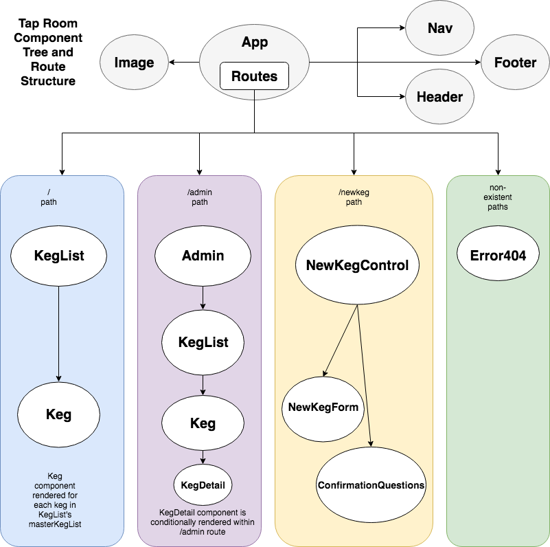

# Tap Room with React
#### _Andrew Lupton, 7/6/2018_

## Description

This app uses the React library to render a refactored version of an Angular app for a keg list at a nonexistent tap room or bar.

## Diagram

## Known Bugs
_None, currently._

## Notes

The app has been refactored to accept and display dynamic data, include an Admin component, and a KegDetail child component of the Keg component which is rendered conditionally within the /admin route.

## Setup

Clone the repository from Github, navigate to the project directory in your terminal, execute `npm install` and `webpack`, execute `npm run start` and then navigate to `localhost:8080` in your browser to view the app.

## Contact

For any further questions, email Andrew Lupton at mailto:aflupton@gmail.com.

### License

*Licensed through the MIT open resource agreement*

_Copyright (c) 2018 **_Andrew Lupton_**_
