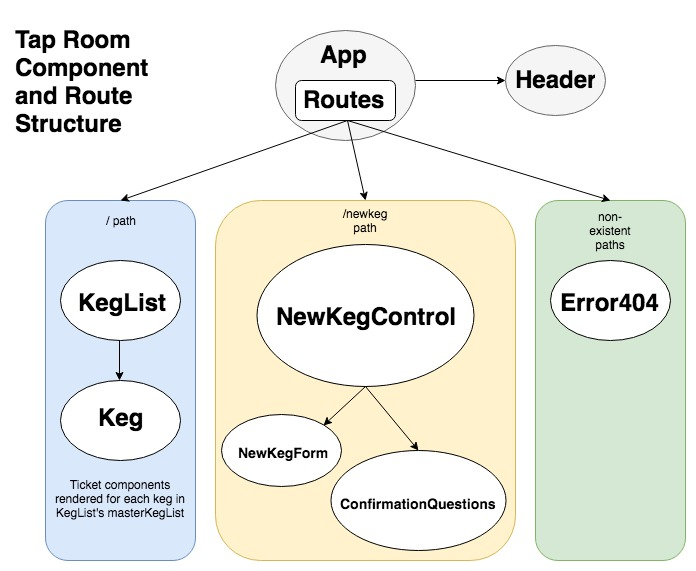

#Tap Room with React
#### _Andrew Lupton, 6/29/2018_

## Description

_This app uses the React library to render a refactored version of an Angular app for the keg list of an invented tap room or bar_

## Diagram

## Known Bugs
_This web app is currently under development._

## Setup

Clone the repository from Github, navigate to the project directory in your terminal, execute `npm install`, and then run `npm run start` and navigate to `localhost:8080` in your browser to view the app.

## Contact

For any further questions, email Andrew Lupton at mailto:aflupton@gmail.com.

### License

*Licensed through the MIT open resource agreement*

Copyright (c) 2018 **_Andrew Lupton_**
